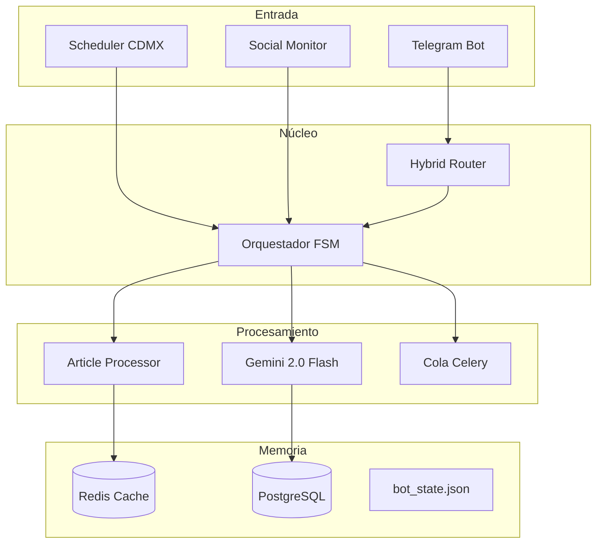

# Nadia Bot - Documentación Completa

## 🎯 Resumen Ejecutivo

**Nadia** es tu asistente de IA que automatiza completamente tu presencia en redes sociales médicas, corriendo desde tu laptop con recuperación inteligente y gestión de interacciones sociales.

---

## 🚀 Funcionalidades Core del MVP

### 1. 🕐 **Sistema de Reloj Inteligente (Laptop Deployment)**
- **Timezone nativo**: America/Mexico_City
- **Persistencia**: `data/bot_state.json` para estado entre reinicios
- **Recuperación automática**: Maneja días perdidos inteligentemente
- **Horario configurable**: Default 10:00 AM CDMX

**Recuperación inteligente**:
- **1 día perdido**: "¿Genero el de ayer ahora?"
- **2-7 días**: "¿Resumen de trending topics?"
- **+7 días**: Auto-continúa con horario normal

### 2. 🔧 **Sistema Híbrido de Comandos**

#### **8 Comandos Core**:
```bash
/start      # Inicializar/reiniciar bot
/generar    # Crear contenido específico
/aprobar    # Aprobar contenido propuesto  
/rechazar   # Rechazar y pedir alternativa
/editar     # Modificar contenido actual
/status     # Estado del bot y estadísticas
/historial  # Ver posts anteriores
/config     # Configurar preferencias
```

#### **Comandos Interacciones Sociales**:
```bash
/revisar    # Overview de comentarios/mensajes
/responder  # Generar respuesta específica
/ignorar    # Marcar como no importante
```

#### **Lenguaje Natural Paralelo**:
- `/editar más empático` == "Hazlo más empático"
- `/aprobar` == "Perfecto, publícalo"
- `/generar diabetes` == "Crea contenido sobre diabetes"

### 3. 📚 **Procesador de Artículos Médicos**

#### **Fuentes soportadas**:
```python
# Auto-detección inteligente
- URLs PubMed → Extrae metadatos automáticamente
- DOIs → Busca en bases científicas
- Texto largo → Analiza como artículo pegado
- Medscape links → Scraping inteligente
```

#### **Flujo de procesamiento**:
```
Usuario: "Hazme un post de esto: https://pubmed.ncbi.nlm.nih.gov/12345"

Bot: 📄 Analizando artículo de PubMed...
     ✅ "Mediterranean Diet and Type 2 Diabetes" - NEJM 2024
     
     📝 Post generado:
     [Contenido con referencias científicas]
     
     ¿Te gusta o quieres ajustes?
```

### 4. 🔍 **Investigación Automática Diaria**
- **Scraping inteligente**: Medscape, PubMed, WHO
- **Personalización**: Según especialidad e intereses  
- **Trending topics**: Relevantes para médicos
- **Priorización**: Artículos usuario > Trending > Temas generales

### 5. 🤖 **Generación de Contenido Adaptativa**

#### **LLM Principal**: Gemini 2.0 Flash
- **Ventana contexto**: 2M tokens vs 128K de GPT-4
- **Costo**: ~10x más barato que GPT-4
- **Fallback**: OpenAI para function calling si Gemini falla

#### **Validación automática**:
- ✅ Información médica correcta
- ✅ Tono personalizado según preferencias
- ✅ Disclaimers automáticos
- ✅ Referencias científicas cuando aplica

### 6. 🔄 **Loop de Aprobación Infinito**

#### **Estados conversacionales**:
```
IDLE → GENERATING → WAITING_APPROVAL → EDITING → APPROVED
                               ↓
                        ARTICLE_PROCESSING
```

#### **Máximo 5 intentos** de edición:
```
Intento 5 → Bot: 🤔 Hemos intentado 5 veces. ¿Quieres:
            1. /generar - Contenido completamente nuevo
            2. /aprobar - Usar la mejor versión anterior  
            3. /programar - Dejarlo para más tarde
```

### 7. 🧠 **Memoria de Largo Plazo Inteligente**

#### **Sistema de temas**:
- **Evita repetir**: Temas recientes (30 días mínimo)
- **Reutilización**: Después de 90+ días con nuevo ángulo
- **Tracking artículos**: No reutilizar fuentes recientes
- **Aprendizaje**: Mejora con cada interacción

#### **Base de datos**:
```sql
-- Historial de temas
CREATE TABLE topic_history (
    user_id VARCHAR(100),
    topic_hash VARCHAR(64),
    last_used TIMESTAMP,
    usage_count INTEGER,
    success_rate FLOAT
);

-- Artículos procesados
CREATE TABLE article_sources (
    id UUID PRIMARY KEY,
    user_id VARCHAR(100),
    source_url TEXT,
    source_type VARCHAR(50),
    title TEXT,
    used_date TIMESTAMP,
    success_rating INTEGER
);
```

### 8. 💬 **Gestión de Interacciones Sociales**

#### **Sistema híbrido con clasificación automática**:
```python
notification_tiers = {
    "urgent": "immediate_notification",    # Emergencias médicas
    "important": "hourly_digest",         # Preguntas relevantes  
    "normal": "manual_review",            # Comentarios generales
    "spam": "auto_filter"                 # Spam/trolls
}
```

#### **Flujo de manejo**:
```
Bot: [Clasifica automáticamente cada 15 min]

Tú: /revisar

Bot: 📱 Actividad últimas 4 horas:
     
     🚨 URGENTES (2):
     • "Mi bebé tiene fiebre alta" - María G. (hace 30 min)
     • "Síntomas de infarto?" - Carlos M. (hace 1 hora)
     
     ⭐ IMPORTANTES (5):
     • Pregunta sobre diabetes - Ana L. 
     
     💬 NORMALES (23): Ver con /comentarios
     🗑️ SPAM filtrado: 12
```

### 9. 📱 **Publicación Multi-plataforma**
- **Facebook** (página profesional)
- **Instagram** (feed + stories)
- **Twitter/X** (formato optimizado)
- **Adaptación automática** por plataforma
- **Manejo de errores**: Publica en plataformas disponibles

---

## 🏗️ Arquitectura del Sistema

### **Componentes principales**:



### **Orquestador FSM (Finite State Machine)**:
- **Director de orquesta**: Decide qué hacer, nunca ejecuta
- **Estados**: IDLE, GENERATING, WAITING_APPROVAL, EDITING, etc.
- **Transiciones**: Basadas en contexto + mensaje usuario
- **Nunca bloquea**: Todo va a workers asíncronos

### **Sistema de Routing Híbrido**:
```python
class HybridRouter:
    async def route_message(self, message, context):
        # 1. Comando explícito → Routing directo
        if message.startswith("/"):
            return await self.handle_command(message)
        
        # 2. Patrón conocido → Routing directo también
        if self.detect_known_pattern(message):
            return await self.handle_pattern(message)
        
        # 3. Casos ambiguos → Análisis con LLM
        else:
            return await self.analyze_with_gemini(message, context)
```

---

## 🛠️ Stack Tecnológico

### **Backend Core**:
```yaml
Language: Python 3.11+
Framework: python-telegram-bot 20.7
Scheduler: APScheduler (reloj interno)
Queue: Celery + Redis
Timezone: pytz (America/Mexico_City)
```

### **AI y Contenido**:
```yaml
Primary LLM: Gemini 2.0 Flash
Fallback LLM: OpenAI GPT-4
Image Generation: DALL-E 3
Article Processing: PubMed API + web scraping
```

### **Storage**:
```yaml
Cache: Redis (contexto, estados)
Database: PostgreSQL (historial, artículos)
Local: JSON files (bot_state.json)
```

### **APIs Externas**:
```yaml
Social Media:
  - Facebook Graph API v18.0
  - Instagram Basic Display API
  - Twitter API v2

Medical Sources:
  - PubMed E-utilities API
  - DOI.org resolution
  - Medscape web scraping
  - WHO RSS feeds
```

---

## 🎭 Flujos de Usuario Completos

### **Flujo 1: Día típico (10:00 AM)**
```
10:00 AM - Bot: 🌅 Buenos días Dr. Roberto!
               
               📊 Investigué trending topics:
               • Nueva variante COVID (WHO, hace 2 horas)
               • Tu artículo guardado: hipertensión + ejercicio
               
               🎯 Propongo: "Ejercicio para hipertensión: nuevas recomendaciones"
               
               [Contenido generado con referencias]

Tú: "Más enfocado a pacientes jóvenes"

Bot: ✏️ Ajustando para adultos jóvenes...
     [Nueva versión]

Tú: /aprobar

Bot: ✅ Publicado en Facebook, Instagram, Twitter
     📅 Mañana: "Mitos sobre colesterol"
```

### **Flujo 2: Artículo específico**
```
Tú: "Hazme un post de esto: https://pubmed.ncbi.nlm.nih.gov/38234567"

Bot: 📄 Analizando artículo de PubMed...
     ✅ "Mediterranean Diet and Type 2 Diabetes" - NEJM 2024
     
     📝 Post con referencias científicas generado
     
Tú: "Agrega estadísticas de México"

Bot: ✏️ Incluyendo contexto mexicano...
     📊 "En México, 8.6 millones viven con diabetes (ENSANUT 2022)"

Tú: /aprobar

Bot: ✅ Publicado + artículo guardado en biblioteca
```

### **Flujo 3: Gestión de interacciones**
```
Tú: /revisar

Bot: 📱 Últimas 4 horas:
     🚨 URGENTES (1): "Mi bebé tiene fiebre 39°C"
     ⭐ IMPORTANTES (3): Preguntas sobre diabetes
     💬 NORMALES (15): Comentarios generales

Tú: /responder urgente_1

Bot: 💬 "Doctor, mi bebé de 8 meses tiene fiebre de 39°C"
     
     🤖 Respuesta sugerida:
     "Fiebre alta en bebés requiere atención inmediata. 
     Acude a urgencias pediátricas ahora."
     
     ¿Aprobar, editar o descartar?

Tú: /aprobar

Bot: ✅ Respuesta enviada + caso marcado como resuelto
```

---

## 📊 Métricas de Éxito MVP

### **Funcionalidad**:
- ✅ 100% comandos funcionando
- ✅ 95% accuracy detección intenciones
- ✅ 90% artículos procesados correctamente
- ✅ 0 errores en reloj interno

### **Performance**:
- ⚡ <500ms respuesta comandos
- ⚡ <2s procesamiento artículos  
- ⚡ <3s generación contenido
- ⚡ 99% uptime en laptop

### **Usuario**:
- 📈 80% posts aprobados sin edición
- 📈 <3 intentos promedio por post
- 📈 90% satisfacción con artículos
- 📈 5+ posts exitosos por semana
- 📈 <2 horas tiempo respuesta interacciones urgentes

---

## 🚀 Valor Inmediato

### **⏱️ Ahorro de tiempo**:
- De **2 horas diarias** a **10 minutos**
- **90% menos tiempo** en redes sociales
- **Cero días sin publicar**

### **📈 Mejor contenido**:
- **Científicamente verificado**
- **Trending topics automáticos**
- **Referencias de calidad**
- **Tono optimizado** para engagement

### **🧠 Inteligencia creciente**:
- **Aprende tu estilo** con cada edición
- **Evita repetirse** automáticamente
- **Procesa artículos** científicos
- **Gestiona interacciones** inteligentemente

### **🔒 Tranquilidad**:
- **Control total** - Nada sin aprobación
- **Backup automático** de contenido
- **Recuperación inteligente** post-ausencias
- **Clasificación urgencias** médicas

---

**En resumen: Nadia es tu clon digital para redes sociales médicas que investiga, crea, aprende, publica y gestiona interacciones, siempre bajo tu supervisión y con tu estilo único.**