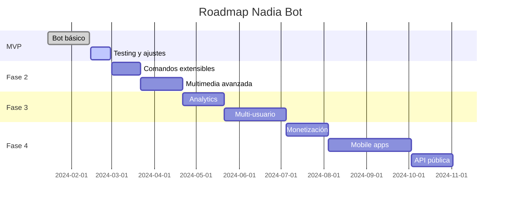

# Roadmap Técnico Detallado - Nadia Bot

## 📋 Issue #1: MVP - Bot Médico para Usuario Único

### ✅ Entregables del MVP

#### 1. Bot de Telegram Funcional
```python
# Estructura básica
bot_redes_sociales/
├── bot/
│   ├── __init__.py
│   ├── main.py              # Entry point
│   ├── handlers/            # Comandos del bot
│   ├── generators/          # Generación de contenido
│   └── publishers/          # Publicación en redes
├── config/
│   ├── settings.py          # Configuración
│   └── prompts.yaml         # Templates de prompts
├── data/
│   ├── models.py           # Modelos de datos
│   └── migrations/         # Esquemas DB
└── tests/
```

#### 2. Funcionalidades implementadas
- ✅ Generación diaria automática a las 10 AM
- ✅ Edición conversacional con contexto
- ✅ Publicación en Facebook, Instagram, Twitter
- ✅ Historial de temas para evitar repetición
- ✅ Comandos básicos: /start, /generar, /programar, /config

#### 3. Stack tecnológico
```yaml
Backend:
  - Python 3.11
  - python-telegram-bot==20.7
  - FastAPI (webhooks)
  - APScheduler (cron jobs)
  
AI/LLM:
  - OpenAI API (GPT-4)
  - DALL-E 3 (imágenes)
  
Storage:
  - PostgreSQL (historial)
  - Redis (contexto/caché)
  
Social APIs:
  - Facebook Graph API v18.0
  - Instagram Basic Display API
  - Twitter API v2
```

## 🚀 Issues Post-MVP

### Issue #2: Sistema de Comandos Extensibles
**Meta**: Arquitectura plugin para agregar comandos sin tocar código core

```python
# Nuevo comando = nuevo archivo
plugins/
├── video_hedra.py
├── infographic_canva.py
├── carousel_generator.py
└── tiktok_script.py

# Registro automático
@command_plugin("video")
class VideoCommand:
    async def execute(self, args):
        # Lógica del comando
```

**Entregables**:
- Sistema de plugins dinámico
- CLI para crear nuevos comandos
- Documentación para desarrolladores

### Issue #3: Generación Multimedia Avanzada
**Meta**: Ir más allá de texto + imagen estática

**Nuevas capacidades**:
1. **Videos cortos** (30-60s)
   - Hedra API para talking avatars
   - D-ID para presentadores IA
   - Remotion para animaciones

2. **Infografías interactivas**
   - Integración con Canva API
   - Templates médicos pre-diseñados
   - Exportación en múltiples formatos

3. **Carruseles educativos**
   - Generación automática de slides
   - Narrativa visual coherente
   - Optimizado para Instagram/LinkedIn

### Issue #4: Analytics y Aprendizaje
**Meta**: Dashboard web para métricas y mejora continua

```python
# Stack para analytics
analytics/
├── collector/          # Recolección de métricas
├── analyzer/          # Procesamiento y ML
├── dashboard/         # Visualización (Streamlit)
└── reports/          # Informes automáticos
```

**Features**:
- Métricas en tiempo real
- Predicción de mejor horario
- A/B testing automático
- Análisis de sentimiento en comentarios

### Issue #5: Multi-usuario y Colaboración
**Meta**: Transformar en plataforma para equipos médicos

**Arquitectura Multi-tenant**:
```python
# Nuevos modelos
class Organization:
    name: str
    subscription_tier: str
    users: List[User]

class User:
    role: Enum["admin", "editor", "viewer"]
    specialties: List[str]
    permissions: Dict
```

**Features**:
- Workspaces por clínica/hospital
- Flujos de aprobación
- Calendario editorial compartido
- Biblioteca de contenido aprobado

### Issue #6: Monetización y SaaS
**Meta**: Modelo de negocio sostenible

**Planes de suscripción**:
```yaml
Tiers:
  Free:
    - 1 usuario
    - 30 posts/mes
    - Marcas de agua
  
  Professional: $29/mes
    - 3 usuarios
    - Posts ilimitados
    - Sin marcas de agua
    - Analytics básico
  
  Clinic: $99/mes
    - 10 usuarios
    - Multi-especialidad
    - API access
    - White label
```

**Integraciones de pago**:
- Stripe para suscripciones
- Usage-based billing para APIs
- Marketplace de templates

### Issue #7: Mobile Apps Nativas
**Meta**: Apps iOS/Android para gestión on-the-go

**Tech stack**:
- React Native / Flutter
- Notificaciones push
- Edición offline
- Cámara integrada para contenido

### Issue #8: API Pública y Marketplace
**Meta**: Ecosistema de desarrolladores

```python
# API REST
GET /api/v1/posts
POST /api/v1/generate
PUT /api/v1/posts/{id}
DELETE /api/v1/posts/{id}

# Webhooks
POST /webhooks/content-generated
POST /webhooks/post-published
```

**Marketplace**:
- Templates por especialidad
- Prompts verificados
- Integraciones third-party
- Revenue sharing 70/30

## 📊 Timeline Estimado



## 🎯 KPIs por Fase

### MVP (Mes 1-2)
- ✅ 1 usuario activo (tú)
- ✅ 95% uptime
- ✅ <2s tiempo de respuesta
- ✅ 0 errores críticos

### Expansión (Mes 3-6)
- 📈 10-50 usuarios beta
- 📈 1000+ posts generados
- 📈 90% satisfacción
- 📈 <$0.10 costo por post

### Crecimiento (Mes 6-12)
- 🚀 500+ usuarios pagados
- 🚀 $15K MRR
- 🚀 3 empleados
- 🚀 99.9% uptime

### Escala (Año 2+)
- 🌟 5000+ usuarios
- 🌟 $150K MRR
- 🌟 Expansión LATAM
- 🌟 Serie A funding?

## 🔧 Decisiones Técnicas Clave

### ¿Por qué Python?
- Mejor ecosistema para IA/ML
- Librerías maduras para Telegram
- Fácil encontrar talento
- Prototipado rápido

### ¿Por qué PostgreSQL + Redis?
- PostgreSQL: ACID, JSONB, escalable
- Redis: Velocidad, pub/sub, caché
- Ambos: Open source, batalla-probados

### ¿Por qué empezar con Telegram?
- API gratuita y potente
- No requiere servidor HTTPS inicial
- Interfaz familiar para usuarios
- Fácil agregar comandos

### ¿Microservicios vs Monolito?
- **MVP**: Monolito modular
- **Fase 3**: Extraer servicios críticos
- **Fase 5**: Microservicios completos

## 🛡️ Consideraciones de Seguridad

1. **Datos médicos**: Encriptación en reposo y tránsito
2. **HIPAA compliance**: Logs de auditoría
3. **OAuth only**: Nunca almacenar passwords
4. **Rate limiting**: Prevenir abuso de APIs
5. **Backups**: Automáticos cada 6 horas

---

*"De un bot personal a una plataforma que democratiza el marketing médico profesional en toda Latinoamérica."*